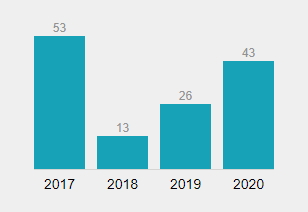
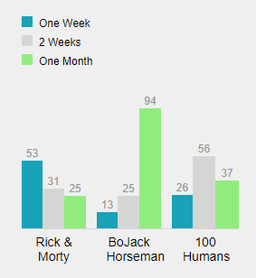
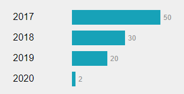
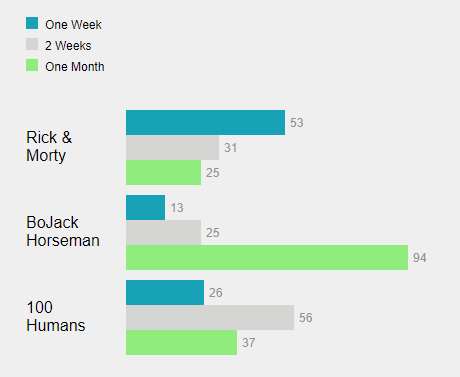
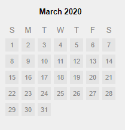
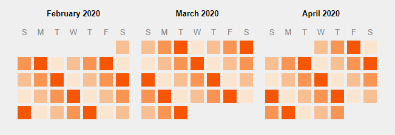
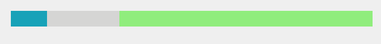

# Muil Charts

Easily add charts to your emails.

Visit [Muil Docs.](https://docs.muil.io)

## Installation

`npm install @muil/charts`

or

`yarn add @muil/charts`

## Usages

#### Bar Chart

##### Single Value



```
import {BarChart} from '@muil/charts'

<BarChart
  height={200}
  legend={false}
  categories={[{ color: '#17a2b8' }]}
  series={[
    {
      label: '2017',
      value: 53,
    },
    {
      label: '2018',
      value: 13,
    },
    {
      label: '2019',
      value: 26,
    },
    {
      label: '2020',
      value: 43,
    },
  ]}
/>
```

##### Multiple Values



```
import {BarChart} from '@muil/charts'

<BarChart
  height={300}
  legend
  categories={[
    { label: 'One Week', color: '#17a2b8' },
    { label: '2 Weeks', color: '#d5d5d4' },
    { label: 'One Month', color: '#90ED7D' }
  ]}
  series={[
    {
      label: 'Rick & Morty',
      data: [53, 31, 25],
    },
    {
      label: 'BoJack Horseman',
      data: [13, 25, 94],
    },
    {
      label: '100 Humans',
      data: [26, 56, 37],
    },
  ]}
/>
```

| Property   | Type                                                                 | Description                                                                     |
| ---------- | -------------------------------------------------------------------- | ------------------------------------------------------------------------------- |
| height     | Number                                                               | height of chart                                                                 |
| className  | String                                                               | class name                                                                      |
| series     | Array of Objects {label: String, value: Number, data: Array(Number)} | label under bar, value - for single percentage, data - for multiple percentages |
| categories | Array of Objects {label: String, color: String}                      | label for legend, color of bar                                                  |
| legend     | Boolean                                                              | show or hide legend                                                             |

#### Horizontal Bar Chart

##### Single Value



```
import {HorizontalBarChart} from '@muil/charts'

<HorizontalBarChart
  maxWidth={400}
  legend={false}
  categories={[{ color: '#17a2b8' }]}
  series={[
    {
      label: '2017',
      value: 50,
    },
    {
      label: '2018',
      value: 30,
    },
    {
      label: '2019',
      value: 20,
    },
    {
      label: '2020',
      value: 2,
    },
  ]}
/>
```

##### Multiple Values



```
import {HorizontalBarChart} from '@muil/charts'

<HorizontalBarChart
  maxWidth={400}
  legend
  categories={[
    { label: 'One Week', color: '#17a2b8' },
    { label: '2 Weeks', color: '#d5d5d4' },
    { label: 'One Month', color: '#90ED7D' }
  ]}
  series={[
    {
      label: 'Rick & Morty',
      data: [53, 31, 25],
    },
    {
      label: 'BoJack Horseman',
      data: [13, 25, 94],
    },
    {
      label: '100 Humans',
      data: [26, 56, 37],
    },
  ]}
/>
```

| Property   | Type                                                                 | Description                                                                     |
| ---------- | -------------------------------------------------------------------- | ------------------------------------------------------------------------------- |
| maxWidth   | Number                                                               | max width of chart                                                              |
| className  | String                                                               | class name                                                                      |
| series     | Array of Objects {label: String, value: Number, data: Array(Number)} | label under bar, value - for single percentage, data - for multiple percentages |
| categories | Array of Objects {label: String, color: String}                      | label for legend, color of bar                                                  |
| legend     | Boolean                                                              | show or hide legend                                                             |

#### Calendar

##### Basic



```
import {Calendar} from '@muil/charts'

<Calendar showNumbers />
```

##### Heat map



```
import {Calendar} from '@muil/charts'

<Calendar
  monthsBefore={1}
  monthsAfter={1}
  dayClassName={({ day }) => `score${day % 4}`}
/>
```

| Property     | Type                                 | Description                           |
| ------------ | ------------------------------------ | ------------------------------------- |
| className    | String                               | class name                            |
| monthsBefore | Number                               | number of months before current month |
| monthsAfter  | Number                               | number of months after current month  |
| showNumbers  | Boolean                              | show or hide day numbers              |
| dayClassName | Function ({day: Number, date: Date}) | return class name for each day        |

#### Line Bar



```
import {LineBar} from '@muil/charts'

<LineBar
  percents={[
    { value: 10, color: '#17a2b8' },
    { value: 20, color: '#d5d5d4' },
    { value: 70, color: '#90ED7D' },
  ]}
/>
```

| Property  | Type                                            | Description                              |
| --------- | ----------------------------------------------- | ---------------------------------------- |
| className | String                                          | class name                               |
| percents  | Array of Objects {value: Number, color: String} | value - percentage, color - color of bar |
